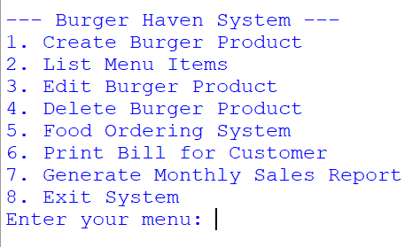
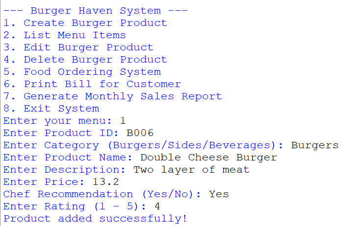
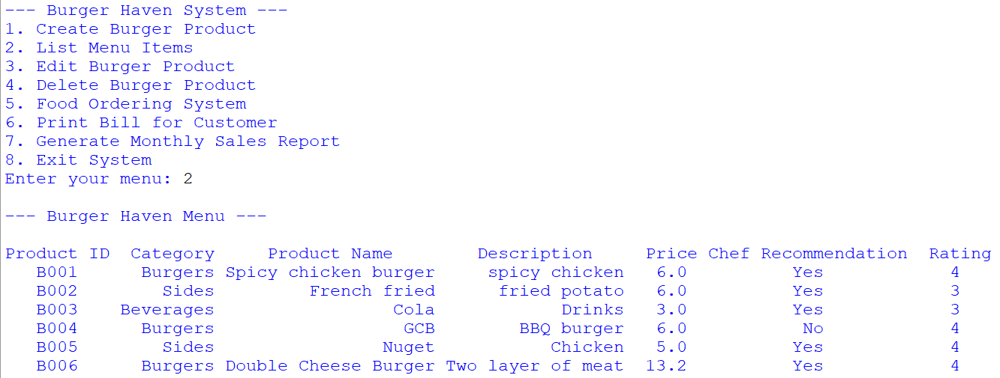
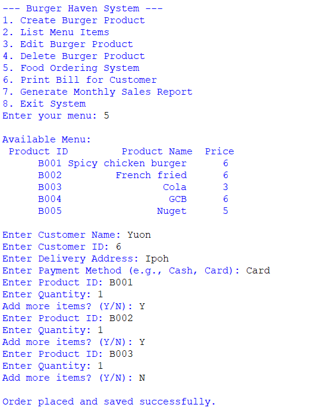
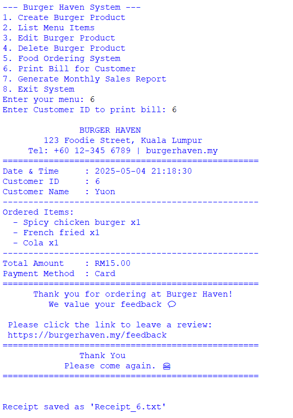
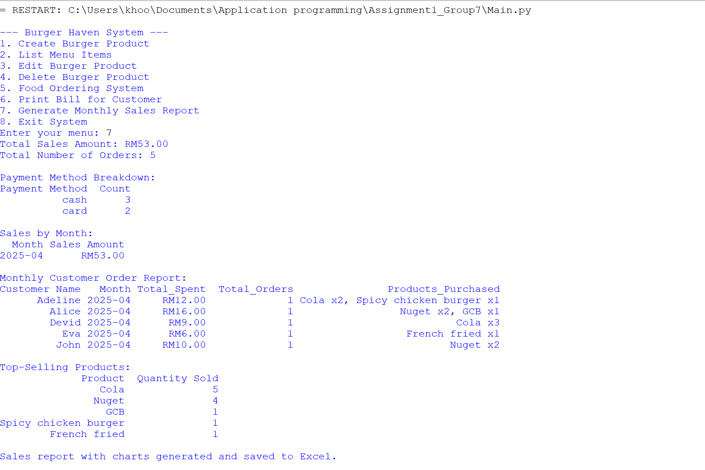

# 🍔 Burger Haven Ordering System

A Python console application developed as a university group project for managing burger orders, menu items, customer records, receipts, and monthly sales reports.

---

## Features

- Create menu items
- Edit menu items
- Delete menu items
- Food ordering
- Print customer receipt
- Monthly sales report
- Excel data storage
- Input validation

---

## Technologies

- Python
- openpyxl
- Excel Workbook
- File Handling

---

## Project Structure

Main.py

AddData.py

EditData.py

DeleteData.py

OrderSystem.py

PrintBill.py

RetrieveData.py

SalesReport.py

---

## How to Run

pip install openpyxl

python Main.py

---
## 📸 Screenshots

### Main Menu

---

### Create Product

---

### List Product

### Food Ordering

---

### Receipt

---

### Monthly Sales Report

---

## Learning Outcomes

- Python programming
- Functions
- File handling
- Excel manipulation
- Team collaboration

